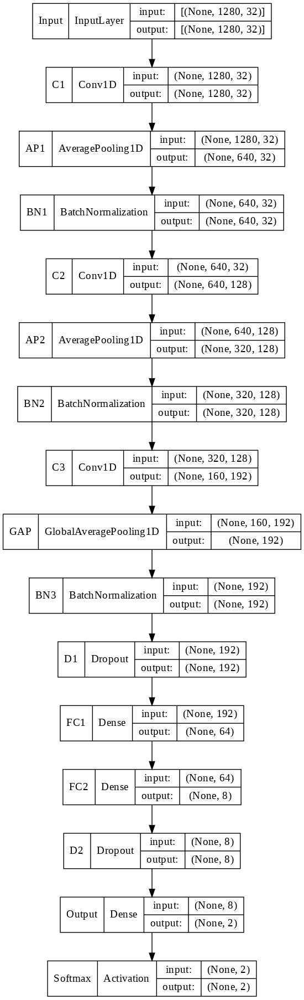
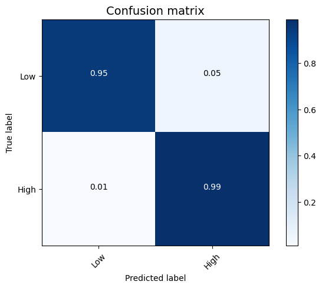
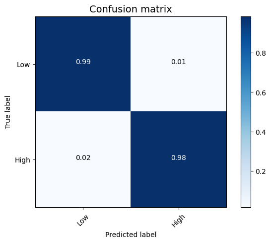
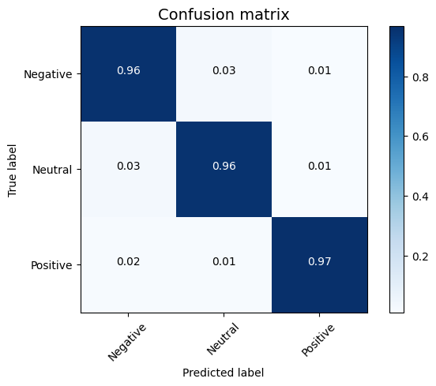

# EEG Emotion Recognition

<p align="center">
  
</p>

EEG-based emotion recognition using convolutional neural networks and hyperparameter optimization on the **DEAP** and **SEED** benchmark datasets.

This repository contains the main notebook, exported figures, and project documentation for my work on **emotion recognition from EEG signals**. The project is based on my master's thesis and explores how careful preprocessing and CNN design can improve classification performance on both dimensional and discrete emotion recognition tasks.

## Overview

Emotion recognition from EEG is an important problem in affective computing, brain-computer interfaces, and human-computer interaction. EEG is especially useful for this task because it reflects brain activity directly and captures information that is difficult to obtain from facial expressions or speech alone.

In this project, I use a compact **1D CNN** for EEG-based emotion classification and improve its performance with hyperparameter optimization. The notebook also includes comparisons against several classical machine learning baselines.

## Project Goals

- Build an EEG-based emotion recognition pipeline
- Preprocess and relabel public benchmark datasets for classification
- Train a compact CNN for emotion recognition
- Improve model design through hyperparameter optimization
- Evaluate performance on both binary and multi-class emotion tasks
- Compare deep learning results with standard ML baselines

## Repository Contents

```text
EEG-Emotion-Recognition/
|-- ER_with_EEG.ipynb
|-- data/
|   `-- README.md
|-- figures/
|   `-- ER_with_EEG/
|       |-- README.md
|       `-- manifest.json
|-- .gitignore
|-- LICENSE
`-- README.md
```

## Main Files

- `ER_with_EEG.ipynb`: main notebook containing preprocessing, model definition, training, evaluation, and baseline experiments
- `figures/ER_with_EEG/`: exported figures from notebook outputs, including learning curves, confusion matrices, and architecture visuals
- `data/README.md`: dataset notes, access guidance, and local folder expectations for DEAP and SEED

## Datasets

### DEAP

**DEAP** is a multimodal dataset for emotion analysis using physiological signals. It includes EEG recordings and self-assessment labels collected while participants watched music video excerpts.

Main characteristics:

- 32 participants
- 40 trials per participant
- 32 EEG channels used in this project
- Emotion dimensions used in this repository: valence, arousal, dominance, and liking

How DEAP is used here:

- Loads the original `.dat` subject files
- Keeps the 32 EEG channels
- Applies Butterworth band-pass filtering
- Uses the alpha band in the current notebook workflow
- Binarizes labels using a 5.5 threshold
- Segments each trial into 10-second windows
- Uses 2-second overlap
- Standardizes each segmented signal before training

This preprocessing supports four binary classification tasks:

- Low vs high valence
- Low vs high arousal
- Low vs high dominance
- Disliking vs liking

### SEED

**SEED** is a public EEG emotion dataset for recognizing discrete emotions induced by film clips.

Main characteristics:

- 15 subjects
- 3 emotion classes: negative, neutral, and positive

How SEED is used here:

- Uses extracted features rather than raw EEG time series
- Works with official extracted feature files and reshapes them for CNN training
- Documents feature types such as DE, PSD, DASM, RASM, ASM, and DCAU
- Includes smoothing methods such as moving average and LDS
- Uses a working configuration based on differential entropy features
- Uses input vectors of 310 dimensions per sample

The final SEED experiment is a three-class classification task:

- Negative
- Neutral
- Positive

## Dataset Access

The datasets are **not included** in this repository.

They are large and may also have their own usage and access conditions, so this repository contains the code, figures, and documentation only. Use the official dataset sources to obtain the data:

- **DEAP**: https://www.eecs.qmul.ac.uk/mmv/datasets/deap/
- **SEED**: https://bcmi.sjtu.edu.cn/home/seed/index.html

See [data/README.md](data/README.md) for the dataset notes and recommended local folder structure.

## Method

### Model

The main deep learning model used in this project is a compact **1D CNN**.

High-level architecture:

1. Conv1D
2. AveragePooling1D
3. BatchNormalization
4. Conv1D
5. AveragePooling1D
6. BatchNormalization
7. Conv1D
8. GlobalAveragePooling1D
9. BatchNormalization
10. Dropout
11. Dense
12. Dense
13. Dropout
14. Softmax output

Optimized CNN configuration used in the notebook:

- `C1`: 32 filters, kernel size 2, stride 1, padding `same`, ReLU
- `C2`: 128 filters, kernel size 5, stride 1, padding `same`, ReLU
- `C3`: 192 filters, kernel size 3, stride 2, padding `same`, ReLU
- `FC1`: 64 units, `tanh`
- `FC2`: 8 units, `tanh`
- Dropout: 0.2 and 0.1

### Hyperparameter Optimization

The notebook includes layer-wise hyperparameter search using **Optuna** to tune parts of the network.

The tuning workflow covers:

- 1st convolution layer (`C1`)
- 2nd convolution layer (`C2`)
- 3rd convolution layer (`C3`)
- 1st dense layer (`FC1`)
- 2nd dense layer (`FC2`)

## Training Setup

### DEAP

- Input shape: `(1280, 32)`
- Train/test split: `80/20`
- Validation split during training: `15%`
- Tasks: valence, arousal, dominance, and liking

### SEED

- Input shape: `(310, 1)`
- Train/test split: `90/10`
- Validation split during training: `15%`
- Task: negative / neutral / positive

## Classical ML Baselines

The notebook also evaluates several traditional machine learning methods on DEAP:

- LDA
- SVM
- Random Forest
- MLP
- KNN

These experiments provide a comparison point for the CNN-based approach.

## Results

### Summary Table

| Dataset | Task | Test Accuracy |
|---|---|---:|
| DEAP | Valence | **96.47%** |
| DEAP | Arousal | **97.54%** |
| DEAP | Dominance | **98.18%** |
| DEAP | Liking | **98.10%** |
| SEED | Negative / Neutral / Positive | **96.14%** |

These results are consistent with the performance reported in the associated thesis experiments.

## Example Figures

### DEAP Valence Confusion Matrix

<p align="center">
  
</p>

### DEAP Arousal Confusion Matrix

<p align="center">
  
</p>

### DEAP Dominance Confusion Matrix

<p align="center">
  
</p>

### DEAP Liking Confusion Matrix

<p align="center">
  
</p>

### SEED Three-Class Confusion Matrix

<p align="center">
  
</p>

## Key Observations

- The optimized CNN performs strongly on both datasets
- The DEAP tasks achieve high binary classification accuracy across all four emotional dimensions
- The SEED experiment also achieves strong multi-class performance
- The CNN outperforms the classical ML baselines included in the notebook
- Careful preprocessing and model tuning matter substantially for EEG emotion recognition

## How To Run

Because the notebook was originally written in **Google Colab**, some paths and commands are still Colab-specific.

Current notebook notes:

- `drive.mount('/content/drive')`
- `!pip install ...`
- hardcoded `/content/...` paths
- Google Drive save/load paths for intermediate arrays

To run locally, you will likely need to:

1. Download the datasets manually from their official sources
2. Replace Google Drive and Colab paths with local project paths
3. Update unzip commands and file-loading paths
4. Install the required Python packages locally
5. Rerun the notebook step by step

Suggested environment:

```bash
pip install numpy scipy matplotlib scikit-learn tensorflow optuna pydot graphviz notebook jupyter
```

## Reproducibility Notes

This repository preserves the notebook close to its original research form. That is useful for transparency, but it also means the project is not yet fully packaged as a clean Python module.

Potential next cleanup steps:

- Move preprocessing into reusable Python scripts
- Replace hardcoded Colab paths with relative paths
- Add a `requirements.txt`
- Add dataset path configuration
- Separate training utilities from analysis cells
- Export final model checkpoints and logs in a cleaner structure

## Research Background

This project is based on my master's thesis:

**Using Evolutionary Computation Algorithms for EEG-based Emotion Recognition**

The thesis studies deep learning for EEG emotion recognition and focuses on improving CNN design through hyperparameter optimization. It evaluates the method on DEAP and SEED and reports strong results for both datasets.

## Citation

If you use this repository, please cite the original datasets and acknowledge the related thesis work.

Suggested acknowledgement:

> This repository is based on thesis work on EEG-based emotion recognition using CNNs and hyperparameter optimization, evaluated on the DEAP and SEED datasets.

## Acknowledgements

- DEAP dataset creators
- SEED dataset creators
- University of Isfahan
- Thesis supervisor and academic collaborators

## Future Work

- Refactor the notebook into a modular Python project
- Support direct raw EEG pipelines for SEED
- Run cross-subject and subject-independent evaluations
- Compare additional architectures such as LSTM, EEGNet, and transformer-based models
- Add experiment tracking and reproducible configuration files

## License

This repository is licensed under the **MIT License**. See [LICENSE](LICENSE) for details.

## Data Note

This repository does **not** redistribute the DEAP or SEED datasets. Please follow the original dataset licenses and access policies when using them.
