# EEG Emotion Recognition

EEG-based emotion recognition using deep learning, benchmark affective datasets, and an optimized CNN-oriented workflow for emotional state classification.

---

## Overview

This repository presents a research project on **emotion recognition from electroencephalography (EEG)**. The work focuses on building a robust deep learning pipeline for classifying emotional states from brain signals, with experiments centered on public benchmark datasets and CNN-based modeling.

The project is rooted in affective computing and brain-computer interface research, where EEG offers a direct physiological window into emotional processing. The broader study investigates optimized CNN architectures for affect classification, while the repository documents the workflow, experimental outputs, and visual summaries of model behavior.

### Main goals

- classify emotional states from EEG recordings
- build a clear preprocessing-to-classification pipeline
- evaluate performance on standard public datasets
- analyze model learning behavior through training curves
- present the project in a clean, reproducible research format

---

## Workflow Overview

The full pipeline is summarized below.


**Original workflow slide:** [workflow_original_slide.pptx](assets/workflow_original_slide.pptx)

At a high level, the project follows four stages:

1. **Input EEG signal acquisition**
2. **Preprocessing** including segmentation and relabeling
3. **CNN-based modeling**
4. **Emotional state classification** on benchmark datasets

The framework covers:

- **DEAP** for binary classification tasks across multiple affective dimensions
- **SEED** for multi-class emotion recognition

---

## Datasets

### DEAP

The **DEAP** dataset is a widely used benchmark for affective EEG analysis. In this project, it is used for binary classification across multiple emotional dimensions:

- **Valence**: low vs high
- **Arousal**: low vs high
- **Dominance**: low vs high
- **Liking**: low vs high

### SEED

The **SEED** dataset is used for **multi-class emotion recognition** with three classes:

- **Negative**
- **Neutral**
- **Positive**

Together, these datasets allow the project to evaluate both binary and multi-class EEG emotion recognition settings.

---

## Methodology

### 1. Preprocessing

The preprocessing stage prepares raw EEG signals for learning by organizing them into model-ready segments and labels. This stage may include operations such as:

- segmentation into analysis windows
- relabeling into target emotion classes
- band-based EEG representation
- train / validation / test splitting

### 2. CNN-based learning

A Convolutional Neural Network (CNN) is used to learn discriminative representations from EEG-derived inputs. The overall design emphasizes:

- compact deep learning modeling
- stable optimization during training
- strong performance on benchmark emotion datasets

### 3. Classification

The final output is an emotional state label. Depending on the dataset, the task is either:

- **binary classification** for DEAP dimensions
- **multi-class classification** for SEED emotions

---

## Reported Performance

The project reports strong results on both DEAP and SEED.

### DEAP accuracy

| Task | Accuracy |
|------|----------|
| Valence | **96.46%** |
| Arousal | **97.54%** |
| Dominance | **98.18%** |
| Liking | **98.10%** |

### SEED accuracy

| Task | Accuracy |
|------|----------|
| Negative / Neutral / Positive | **96.14%** |

These results highlight the effectiveness of the proposed EEG emotion recognition framework across both binary and multi-class settings.

---

## Training Behavior

The following plots provide a visual summary of the model training dynamics.

### Accuracy curve


### Loss curve


The curves show a stable learning process, with training performance improving steadily and validation behavior remaining consistently strong throughout the optimization process.

---

## Complete Figure Gallery

The sections below include **all exported figures currently tracked in the repository**, including the confusion matrices, CNN diagrams, training plots, and classical baseline outputs from the notebook.

<details>
<summary>DEAP Loading And Baseline CNN</summary>

### Figure 01

Notebook section: `Loading Data > Loading and Pre-processing Deap Dataset`

<p align="center">
  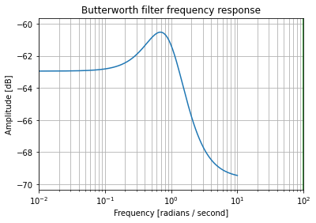
</p>

### Figure 02

Notebook section: `CNN Model Before HP Tuning > Loading Data and Labels`

<p align="center">
  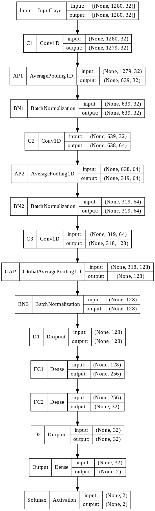
</p>

### Figure 03

Notebook section: `Training and Evaluation Before HP Tuning > Training and Evaluation > Training and Evaluation`

<p align="center">
  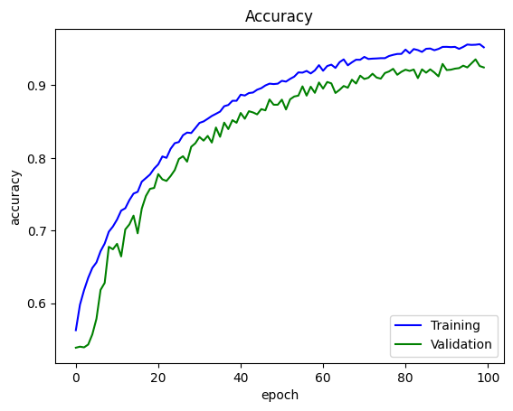
</p>

### Figure 04

Notebook section: `Training and Evaluation Before HP Tuning > Training and Evaluation > Training and Evaluation`

<p align="center">
  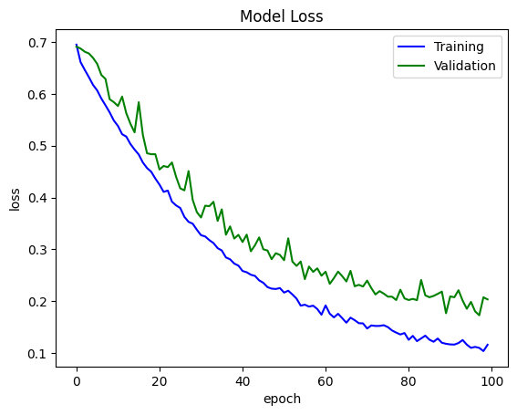
</p>

### Figure 05

Notebook section: `Training and Evaluation Before HP Tuning > Training and Evaluation > Training and Evaluation`

<p align="center">
  
</p>

### Figure 06

Notebook section: `Training and Evaluation Before HP Tuning > Training and Evaluation > Training and Evaluation`

<p align="center">
  
</p>

</details>

<details>
<summary>Optimized CNN And DEAP Valence Outputs</summary>

### Figure 07

Notebook section: `CNN Model > 5th Layer (i.e. Dense2) HPO > Training and Evaluation`

<p align="center">
  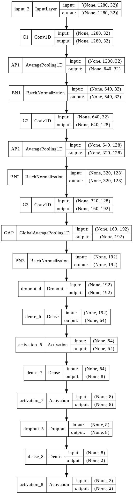
</p>

### Figure 08

Notebook section: `CNN Model > 5th Layer (i.e. Dense2) HPO > Training and Evaluation`

<p align="center">
  
</p>

### Figure 09

Notebook section: `Training and Evaluation > Training and Evaluation with std calculation > Training and Evaluation with std calculation`

<p align="center">
  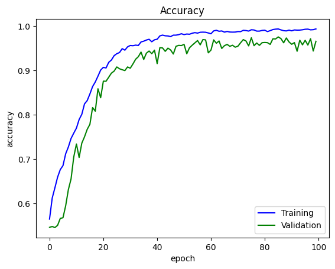
</p>

### Figure 10

Notebook section: `Training and Evaluation > Training and Evaluation with std calculation > Training and Evaluation with std calculation`

<p align="center">
  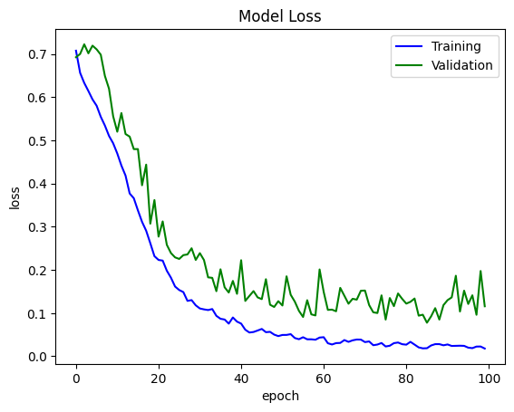
</p>

### Figure 11

Notebook section: `Training and Evaluation > Training and Evaluation with std calculation > Training and Evaluation with std calculation`

<p align="center">
  
</p>

### Figure 12

Notebook section: `Training and Evaluation > Training and Evaluation with std calculation > Training and Evaluation with std calculation`

<p align="center">
  
</p>

### Figure 13

Notebook section: `Training and Evaluation > Training and Evaluation > Training and Evaluation`

<p align="center">
  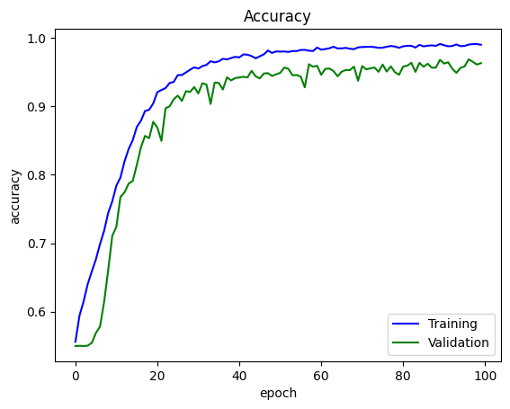
</p>

### Figure 14

Notebook section: `Training and Evaluation > Training and Evaluation > Training and Evaluation`

<p align="center">
  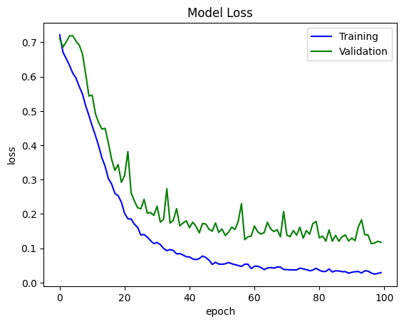
</p>

### Figure 15

Notebook section: `Training and Evaluation > Training and Evaluation > Training and Evaluation`

<p align="center">
  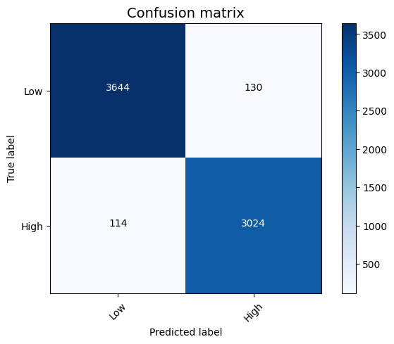
</p>

### Figure 16

Notebook section: `Training and Evaluation > Training and Evaluation > Training and Evaluation`

<p align="center">
  
</p>

</details>

<details>
<summary>DEAP Arousal Outputs</summary>

### Figure 17

Notebook section: `Training and Evaluation > Training and Evaluation with std calculation > Training and Evaluation with std calculation`

<p align="center">
  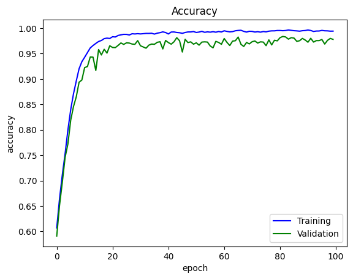
</p>

### Figure 18

Notebook section: `Training and Evaluation > Training and Evaluation with std calculation > Training and Evaluation with std calculation`

<p align="center">
  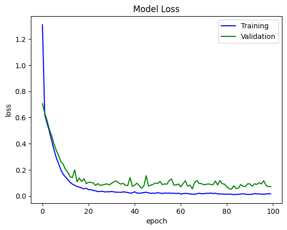
</p>

### Figure 19

Notebook section: `Training and Evaluation > Training and Evaluation with std calculation > Training and Evaluation with std calculation`

<p align="center">
  
</p>

### Figure 20

Notebook section: `Training and Evaluation > Training and Evaluation with std calculation > Training and Evaluation with std calculation`

<p align="center">
  
</p>

### Figure 21

Notebook section: `Training and Evaluation > Training and Evaluation > Training and Evaluation`

<p align="center">
  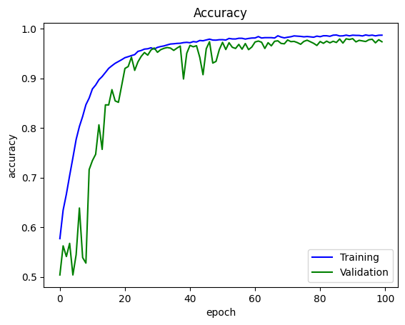
</p>

### Figure 22

Notebook section: `Training and Evaluation > Training and Evaluation > Training and Evaluation`

<p align="center">
  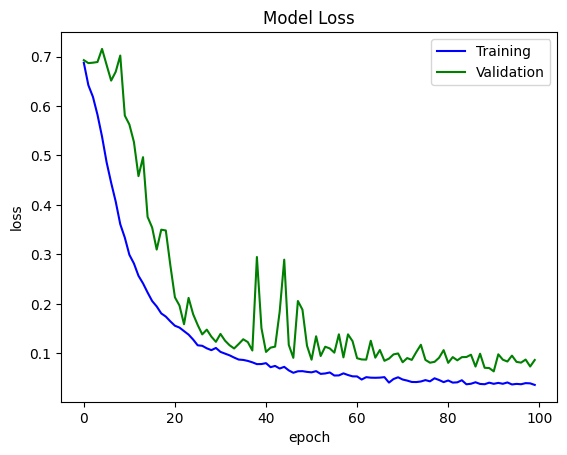
</p>

### Figure 23

Notebook section: `Training and Evaluation > Training and Evaluation > Training and Evaluation`

<p align="center">
  
</p>

### Figure 24

Notebook section: `Training and Evaluation > Training and Evaluation > Training and Evaluation`

<p align="center">
  
</p>

</details>

<details>
<summary>DEAP Dominance Outputs</summary>

### Figure 25

Notebook section: `Training and Evaluation > Training and Evaluation with std calculation > Training and Evaluation with std calculation`

<p align="center">
  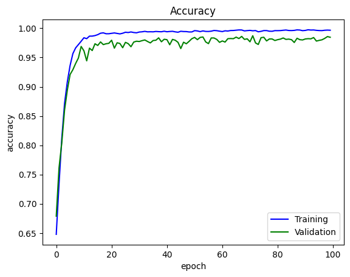
</p>

### Figure 26

Notebook section: `Training and Evaluation > Training and Evaluation with std calculation > Training and Evaluation with std calculation`

<p align="center">
  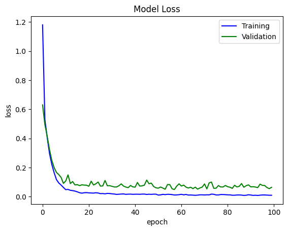
</p>

### Figure 27

Notebook section: `Training and Evaluation > Training and Evaluation with std calculation > Training and Evaluation with std calculation`

<p align="center">
  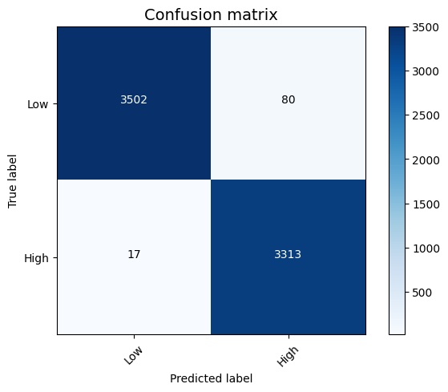
</p>

### Figure 28

Notebook section: `Training and Evaluation > Training and Evaluation with std calculation > Training and Evaluation with std calculation`

<p align="center">
  
</p>

### Figure 29

Notebook section: `Training and Evaluation > Training and Evaluation > Training and Evaluation`

<p align="center">
  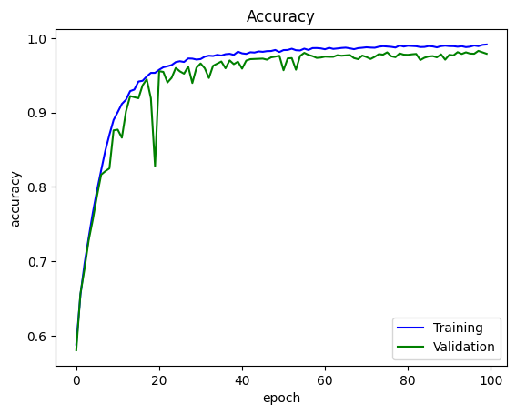
</p>

### Figure 30

Notebook section: `Training and Evaluation > Training and Evaluation > Training and Evaluation`

<p align="center">
  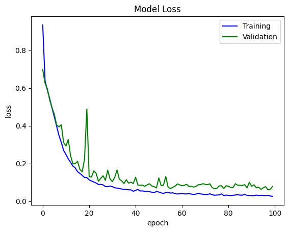
</p>

### Figure 31

Notebook section: `Training and Evaluation > Training and Evaluation > Training and Evaluation`

<p align="center">
  
</p>

### Figure 32

Notebook section: `Training and Evaluation > Training and Evaluation > Training and Evaluation`

<p align="center">
  
</p>

</details>

<details>
<summary>DEAP Liking Outputs</summary>

### Figure 33

Notebook section: `Training and Evaluation > Training and Evaluation with std calculation > Training and Evaluation with std calculation`

<p align="center">
  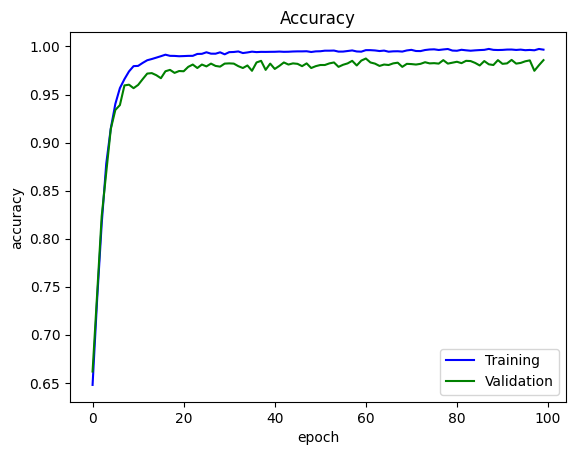
</p>

### Figure 34

Notebook section: `Training and Evaluation > Training and Evaluation with std calculation > Training and Evaluation with std calculation`

<p align="center">
  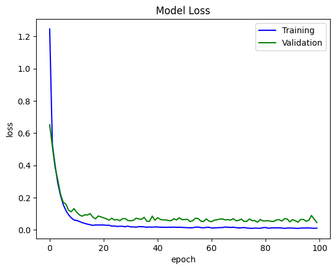
</p>

### Figure 35

Notebook section: `Training and Evaluation > Training and Evaluation with std calculation > Training and Evaluation with std calculation`

<p align="center">
  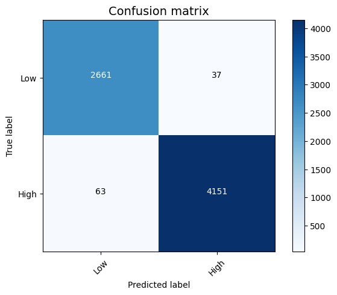
</p>

### Figure 36

Notebook section: `Training and Evaluation > Training and Evaluation with std calculation > Training and Evaluation with std calculation`

<p align="center">
  
</p>

### Figure 37

Notebook section: `Training and Evaluation > Training and Evaluation > Training and Evaluation`

<p align="center">
  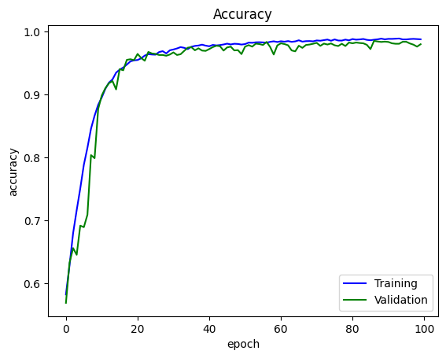
</p>

### Figure 38

Notebook section: `Training and Evaluation > Training and Evaluation > Training and Evaluation`

<p align="center">
  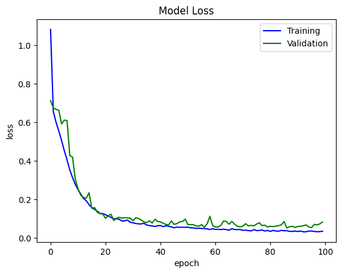
</p>

### Figure 39

Notebook section: `Training and Evaluation > Training and Evaluation > Training and Evaluation`

<p align="center">
  
</p>

### Figure 40

Notebook section: `Training and Evaluation > Training and Evaluation > Training and Evaluation`

<p align="center">
  
</p>

</details>

<details>
<summary>Classical ML Baseline Outputs</summary>

### Figure 41

Notebook section: `ML Models > SVM > Training and Evaluation`

<p align="center">
  
</p>

### Figure 42

Notebook section: `ML Models > RFC > Training and Evaluation`

<p align="center">
  
</p>

### Figure 43

Notebook section: `ML Models > MLP > Training and Evaluation`

<p align="center">
  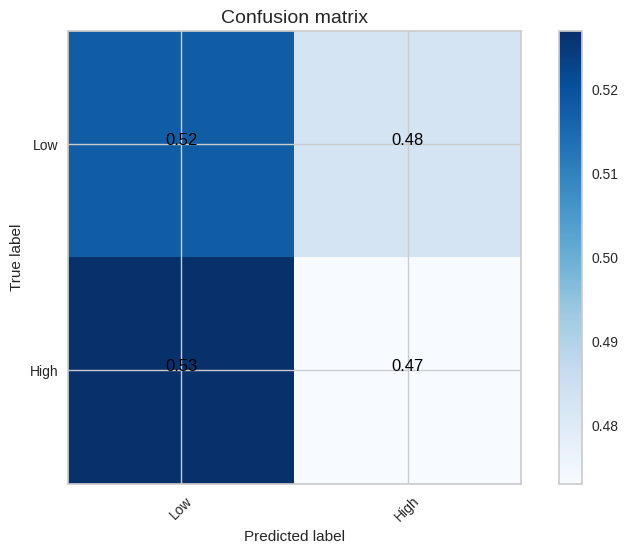
</p>

### Figure 44

Notebook section: `ML Models > KNN > Training and Evaluation`

<p align="center">
  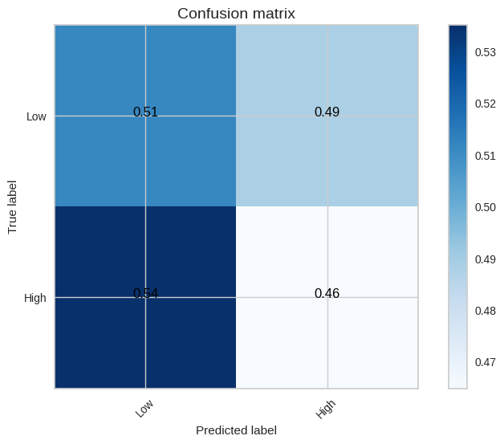
</p>

</details>

<details>
<summary>SEED Outputs</summary>

### Figure 45

Notebook section: `CNN Model > Loading and Pre-processing SEED Dataset > Training and Evaluation`

<p align="center">
  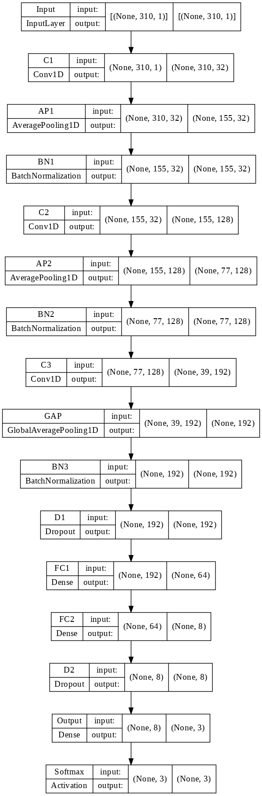
</p>

### Figure 46

Notebook section: `Training and Evaluation > Loading and Pre-processing SEED Dataset > Training and Evaluation`

<p align="center">
  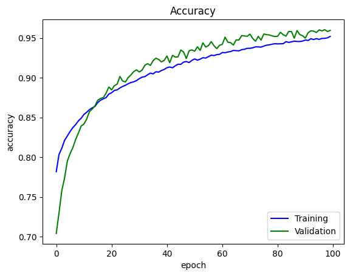
</p>

### Figure 47

Notebook section: `Training and Evaluation > Loading and Pre-processing SEED Dataset > Training and Evaluation`

<p align="center">
  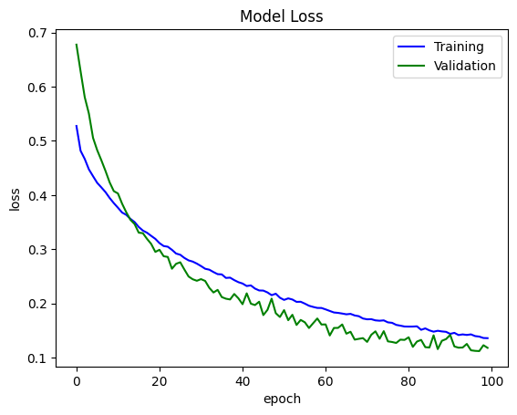
</p>

### Figure 48

Notebook section: `Training and Evaluation > Loading and Pre-processing SEED Dataset > Training and Evaluation`

<p align="center">
  
</p>

</details>

---

## Why This Project Matters

Emotion recognition from EEG is relevant to several active research and application areas, including:

- **affective computing**
- **brain-computer interfaces**
- **human-computer interaction**
- **adaptive intelligent systems**
- **mental health and assistive technologies**

Compared with surface-level behavioral signals, EEG provides a physiological measure that can capture internal emotional dynamics more directly.

---

## Suggested Repository Structure

A clean structure for this project can follow the layout below:

```text
EEG-Emotion-Recognition/
├── README.md
├── assets/
│   ├── workflow_overview.png
│   ├── workflow_original_slide.pptx
│   ├── training_accuracy.png
│   └── training_loss.png
├── notebooks/
├── src/
├── data/
├── results/
└── docs/
```

---

## Future Directions

Potential next steps for extending this work include:

- subject-independent evaluation
- cross-dataset generalization
- explainable AI for EEG feature importance
- attention-based or transformer-based EEG models
- real-time emotion recognition pipelines
- broader comparison with alternative deep learning baselines

---

## Author

**Parichehr Moradi**  
Biomedical Engineering Researcher  
Focus areas: EEG, affective computing, deep learning, biomedical signal analysis

---

## Citation

If this repository is used in academic or technical work, please cite the corresponding thesis or project report.

```bibtex
@mastersthesis{moradi2022eegemotion,
  title     = {Using Evolutionary Computation Algorithms for EEG-Based Emotion Recognition},
  author    = {Moradi, Parichehr},
  school    = {University of Isfahan},
  year      = {2022}
}
```
