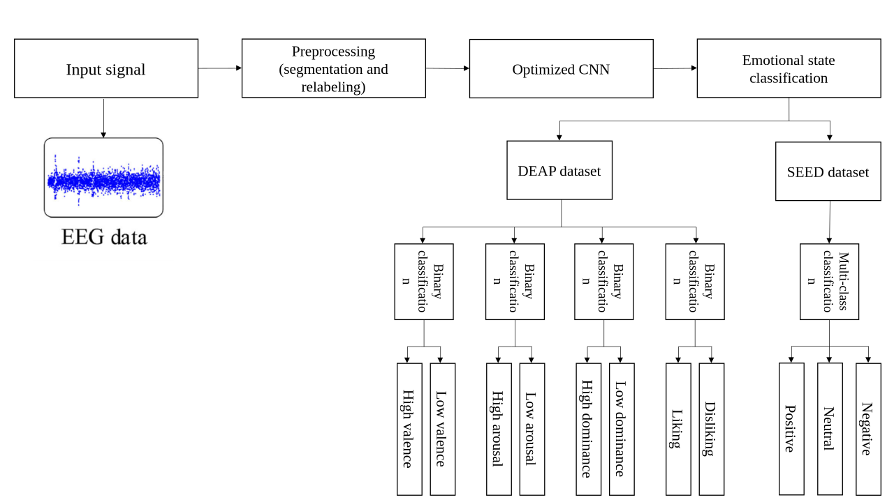
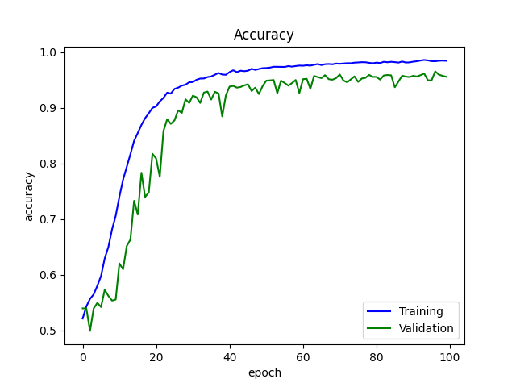
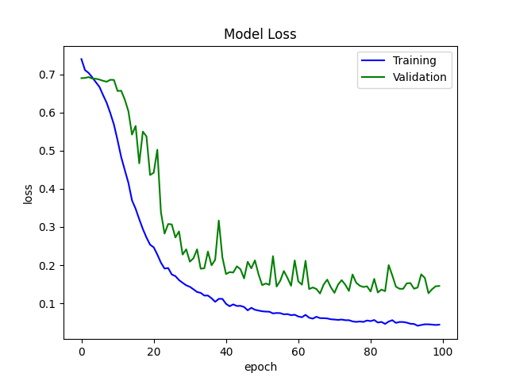

# EEG Emotion Recognition

EEG-based emotion recognition using deep learning and multi-objective hyperparameter optimization for emotional state classification on benchmark datasets.

> This repository is based on my M.Sc. thesis:  
> **EEG-Based Emotion Recognition Using Convolutional Neural Networks and Hyperparameter Optimization**  
> **Parichehr Moradi**  
> Department of Biomedical Engineering, Faculty of Engineering, University of Isfahan, 2022

---

## Overview

This repository presents a research project on **emotion recognition from electroencephalography (EEG)** signals. The work is situated at the intersection of:

- **affective computing**
- **brain-computer interfaces (BCI)**
- **deep learning for biomedical signal analysis**
- **EEG-based human state understanding**

The main objective is to classify emotional states directly from EEG recordings using a **Convolutional Neural Network (CNN)** framework, while improving the network design through **automatic hyperparameter optimization**.

Unlike many EEG emotion recognition pipelines that rely on manually selected CNN settings, this work investigates a more systematic strategy for finding effective CNN structures using an **evolutionary multi-objective optimization algorithm (NSGA-II)**.

---

## Thesis Background

This repository is derived from my master's thesis:

**Title:** *Using Evolutionary Computation Algorithms for EEG-based Emotion Recognition*  
**Author:** Parichehr Moradi  
**Degree:** M.Sc. in Biomedical Engineering  
**Institution:** University of Isfahan  
**Supervisor:** Dr. Mohammadreza Yazdchi  
**Year:** 2022

The thesis studies how **deep CNN architectures** can be improved for EEG-based emotion recognition by automatically optimizing their hyperparameters instead of selecting them manually.

---

## Research Motivation

Emotion plays an important role in human communication and interaction. In human-computer interaction and affective computing, reliable emotion recognition can support:

- adaptive intelligent systems
- assistive and healthcare technologies
- mental-state-aware interfaces
- emotion-aware brain-computer interfaces

Compared with facial expressions or speech, **EEG provides a more direct physiological representation of internal emotional processing**, making it a valuable signal source for affect recognition research.

---

## Main Contribution

The central contribution of this work is an **optimized CNN-based EEG emotion recognition framework** with the following characteristics:

- EEG-based emotion classification on public benchmark datasets
- CNN-based deep learning for automatic feature learning
- **layer-by-layer hyperparameter optimization**
- use of **Non-dominated Sorting Genetic Algorithm II (NSGA-II)** for multi-objective optimization
- evaluation on both **binary** and **multi-class** emotion recognition settings

In this project, hyperparameter optimization is not treated as a minor tuning step. Instead, it is part of the proposed methodology for improving CNN structure selection in a principled way.

---

## Workflow Overview

The overall workflow of the project can be summarized as:

1. **EEG signal acquisition**
2. **Preprocessing and data preparation**
3. **Segmentation / relabeling**
4. **CNN model construction**
5. **Hyperparameter optimization using NSGA-II**
6. **Training and evaluation**
7. **Performance analysis through curves and confusion matrices**

### Pipeline figure



**Original slide:** [workflow_original_slide.pptx](assets/workflow_original_slide.pptx)

---

## Datasets

### 1. DEAP

The **DEAP** dataset is used for binary affective classification across four emotion-related dimensions:

- **Valence**: low vs. high
- **Arousal**: low vs. high
- **Dominance**: low vs. high
- **Liking**: low vs. high

### 2. SEED

The **SEED** dataset is used for **three-class emotion recognition**:

- **Negative**
- **Neutral**
- **Positive**

Using both datasets allows evaluation in two complementary scenarios:

- **binary classification** on DEAP
- **multi-class classification** on SEED

---

## Methodology

### 1) Preprocessing

The preprocessing stage prepares EEG signals for model training. Depending on the dataset and experiment, this includes:

- organizing EEG samples into learning-ready inputs
- segmentation into analysis windows
- relabeling into emotion classes
- generating band-based or structured EEG representations
- splitting data into training / validation / test sets

### 2) CNN-based Emotion Recognition

A CNN is used to learn discriminative representations from EEG-derived inputs. The model is designed to support stable learning and strong classification performance for EEG emotion recognition tasks.

The network design includes common deep learning building blocks such as:

- convolutional layers
- pooling layers
- batch normalization
- dropout
- fully connected layers
- softmax output for classification

### 3) Hyperparameter Optimization with NSGA-II

A key part of this work is the use of **NSGA-II** to optimize CNN hyperparameters.

Examples of optimized design choices may include:

- number of convolutional layers
- number of filters
- kernel sizes
- activation functions
- fully connected layer configuration
- optimization-related settings

The optimization process follows a **layer-by-layer strategy**, aiming to find a model structure that improves classification performance while supporting effective training.

---

## Reported Results

### DEAP Test Accuracy

| Task | Accuracy |
|------|----------|
| Valence | **96.46%** |
| Arousal | **97.54%** |
| Dominance | **98.18%** |
| Liking | **98.10%** |

### SEED Test Accuracy

| Task | Accuracy |
|------|----------|
| Negative / Neutral / Positive | **96.14%** |

These results indicate that the proposed optimized CNN framework performs strongly on both DEAP and SEED.

---

## Training Behavior

The repository includes training plots that summarize model learning dynamics.

### Accuracy Curve



### Loss Curve



These figures illustrate the optimization behavior during training and provide a compact visual summary of model convergence.

---

## Figures Folder

The [`figures/`](figures/) directory contains exported visual outputs from the project, including:

- workflow and pipeline figures
- CNN architecture-related diagrams
- training and validation curves
- confusion matrices
- DEAP outputs for Valence, Arousal, Dominance, and Liking
- SEED output figures
- classical machine learning baseline outputs

This figure collection is useful for understanding both the baseline and optimized experiments without reading the full notebook line by line.

### Figure groups currently represented in the repository

- **DEAP loading and baseline CNN**
- **Optimized CNN and DEAP Valence outputs**
- **DEAP Arousal outputs**
- **DEAP Dominance outputs**
- **DEAP Liking outputs**
- **Classical ML baseline outputs**
- **SEED outputs**

---

## Repository Contents

At the moment, this repository mainly documents the project through:

- the README
- visual assets
- exported figures
- research results and summaries

A clean long-term structure for the repository can follow a layout such as:

```text
EEG-Emotion-Recognition/
├── README.md
├── assets/
│   ├── workflow_overview.png
│   ├── workflow_original_slide.pptx
│   ├── training_accuracy.png
│   └── training_loss.png
├── figures/
├── notebooks/
├── src/
├── data/
├── results/
└── docs/
```

If code, notebooks, or experiment scripts are added later, they can be organized in the directories above.

---

## Reproducibility Note

This repository is a **research-oriented project repository** derived from an academic thesis. Depending on the current version of the repository, some parts may emphasize:

- documentation
- figures
- experiment outputs
- model summaries

more than a polished software package.

If you plan to extend this repository, useful additions would include:

- environment requirements
- dataset preparation instructions
- training scripts
- evaluation scripts
- saved model checkpoints
- configuration files for hyperparameter search

---

## Why This Project Matters

EEG-based emotion recognition has relevance in several active areas of research and application, including:

- affective computing
- brain-computer interfaces
- intelligent adaptive systems
- assistive technology
- biomedical AI
- mental health support systems

Because EEG reflects neural activity more directly than surface behavioral cues alone, it can provide a promising signal source for robust emotion recognition.

---

## Limitations

As with many EEG emotion recognition studies, important challenges remain, such as:

- subject variability
- dataset dependency
- generalization across recording settings
- sensitivity to preprocessing choices
- reproducibility across implementations

These challenges also motivate continued work on better architectures and more robust evaluation protocols.

---

## Future Work

Possible future extensions of this project include:

- subject-independent evaluation
- cross-dataset generalization
- explainable AI for EEG-based decisions
- transformer-based or attention-based EEG models
- real-time emotion recognition systems
- broader comparison with additional deep learning and classical baselines

---

## Thesis Citation

If you use this repository in academic work, please cite the thesis:

```bibtex
@mastersthesis{moradi2022eegemotion,
  title     = {Using Evolutionary Computation Algorithms for EEG-based Emotion Recognition},
  author    = {Moradi, Parichehr},
  school    = {University of Isfahan},
  year      = {2022},
  type      = {M.Sc. Thesis}
}
```

---

## Repository Citation

If you also want to cite the repository itself, you can use a GitHub citation entry or create a `CITATION.cff` file in the repository.

Example BibTeX entry:

```bibtex
@misc{moradi_eeg_emotion_recognition,
  author       = {Parichehr Moradi},
  title        = {EEG Emotion Recognition},
  year         = {2025},
  publisher    = {GitHub},
  howpublished = {\url{https://github.com/Parichehr13/EEG-Emotion-Recognition}}
}
```

---

## Author

**Parichehr Moradi**  
Biomedical Engineering Researcher  

Research interests:

- EEG signal processing
- affective computing
- deep learning
- biomedical data analysis

---

## Acknowledgment

This repository is based on my master's thesis research at the **University of Isfahan** under the supervision of **Dr. Mohammadreza Yazdchi**.

---

## Notes

- Dataset access may depend on the official providers of **DEAP** and **SEED**.
- Please follow the original dataset licenses and usage terms.
- This repository is intended for research and educational purposes.
